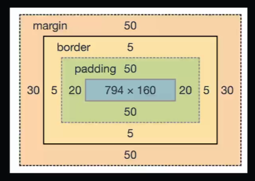

# Box Model

## Tudo são caixas
 Todos os elementos `HTML` serão 
 considerados uma caixa, assim
 como uma caixa de papelão.

## Caixas possuem determinadas propriedades
 Conteúdo, largura, altura, borda
 preenchimento (espaço interno),
 espaçamento (espaço externo).
 